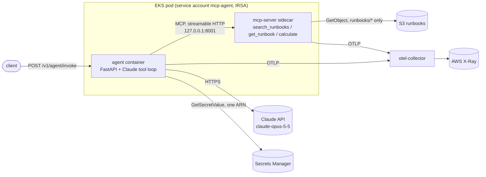

# MCP agent on EKS

An on-call assistant built on Claude that answers operational questions from a team's
runbooks. The agent gets its tools from an **MCP server**, is served through **FastAPI**,
runs on **EKS** provisioned with **Terraform**, emits **OpenTelemetry** traces, ships only
through an **evaluation gate**, and every AWS identity in it has **least-privilege** access.



## What is where

| Path | What it is |
| --- | --- |
| `src/agent_service/agent/loop.py` | The agent: a Claude tool-use loop whose tool list comes from the MCP server. Step cap, tool allowlist, per-tool timeout, refusal handling. |
| `src/agent_service/mcp_server/` | MCP server (FastMCP): BM25 runbook search, runbook fetch, AST-based calculator. Local files or S3 backend. |
| `src/agent_service/api/main.py` | FastAPI app: `/v1/agent/invoke`, `/healthz`, `/readyz` (ready only when MCP answers), optional bearer token. |
| `src/agent_service/telemetry.py` | OpenTelemetry setup; spans follow the GenAI semantic conventions. |
| `evals/` | Eval cases, deterministic graders, thresholds, and the gate runner. |
| `infra/terraform/` | VPC, EKS, node group, IRSA roles, S3, Secrets Manager, ECR, GitHub OIDC deploy role, plus offline policy tests. |
| `deploy/k8s/` | Kustomize base and prod overlay: deployment with native MCP sidecar, HPA, PDB, NetworkPolicies, OTel collector. |
| `.github/workflows/ci.yml` | Lint, tests, both eval gates, Terraform checks, manifest validation, image scan, gated deploy. |

## Run it locally

```bash
make install
make test           # 35 unit tests, no network or API key
make eval-offline   # retrieval eval gate
export ANTHROPIC_API_KEY=...   # or `ant auth login`
make run            # http://localhost:8080, MCP server in-process
curl -s localhost:8080/v1/agent/invoke -H 'content-type: application/json' \
  -d '{"message": "Our pods are in CrashLoopBackOff, what do I check?"}'
```

To run the MCP server as a separate process the way it runs in EKS:
`make run-mcp` in one shell, then `MCP_SERVER_URL=http://127.0.0.1:8001/mcp make run`.
Add `OTEL_CONSOLE_EXPORT=true` to print spans.

## The agent

* Model `claude-opus-5-5` with adaptive thinking and an explicit `effort` (`medium` by
  default, the model's own default, set explicitly so it cannot drift).
* Tools are discovered at runtime from the MCP server (`list_tools`), so adding a tool to
  the server needs no agent change. The agent only executes tools that server listed.
* A manual loop rather than the SDK's beta tool runner, so each model call and tool call
  gets its own span and the guardrails live in one readable place: `AGENT_MAX_STEPS`
  (default 8), a per-tool timeout, 20k-character tool-result cap, parallel tool calls
  returned in a single message.
* Server-side refusal fallback (`fallbacks: "default"`) is enabled: if a safety classifier
  declines, the API re-runs the request on Anthropic's recommended fallback model. A
  final `stop_reason: "refusal"` is returned to the caller as a refusal, not an error.
* The MCP server runs as a native sidecar bound to `127.0.0.1`, so nothing outside the
  pod can call its tools, and requests carry `traceparent` so one trace spans both
  containers.

## Evaluation gates

Two suites, both thresholded in `evals/thresholds.json`; a miss exits non-zero and blocks
the deploy job.

| Suite | Runs | Measures | Threshold |
| --- | --- | --- | --- |
| `retrieval` | every PR, no secrets | recall@1 and recall@3 of `search_runbooks`, called over MCP | ≥ 0.85, = 1.0 |
| `agent` | every PR with the key, always before deploy | per case: finished, expected tools used, expected runbooks cited as `[runbook:id]`, required facts present, out-of-scope questions not answered from a runbook; plus average steps and p95 latency | pass rate ≥ 0.9, avg steps ≤ 5, p95 ≤ 90 s |

Graders are deterministic (substring, citation and tool checks), so a failure points at a
specific case and check. `tests/test_evals.py` proves the gate bites: a fake agent that
always parrots the top search hit scores 8/10 and is rejected. Reports are uploaded as CI
artifacts and summarised on the run page.

On a push to `main`, a missing `ANTHROPIC_API_KEY` fails the agent gate instead of skipping
it, so nothing deploys unevaluated.

## Tracing

Every request produces one trace:

```
POST /v1/agent/invoke                       (FastAPI)
└─ invoke_agent ops-agent                   steps, stop reason, total tokens
   ├─ chat claude-opus-5-5                  model, finish reason, input/output/cache tokens
   ├─ execute_tool search_runbooks          tool name, call id, error flag
   │  └─ POST /mcp  →  mcp-runbooks service  (sidecar, same trace id)
   └─ chat claude-opus-5-5
```

Prompts and answers are never written to spans, only sizes, counts and ids. The response
body includes `trace_id` so a slow or wrong answer can be looked up directly. In EKS the
collector exports to X-Ray and indexes model, tool and stop reason.

## Least-privilege AWS access

| Identity | Can do | Cannot do |
| --- | --- | --- |
| Agent pod (IRSA, trusts only `agent/mcp-agent`) | `s3:ListBucket` with prefix `runbooks/`, `s3:GetObject` on `runbooks/*`, `secretsmanager:GetSecretValue` on one secret, `kms:Decrypt` only via S3 or Secrets Manager | read other prefixes or secrets, write anything |
| OTel collector (IRSA, trusts only `agent/otel-collector`) | write X-Ray traces | anything else |
| VPC CNI (IRSA, `kube-system/aws-node`) | `AmazonEKS_CNI_Policy` | (moved off the node role) |
| Nodes | join the cluster, pull from ECR | lend their role to pods: IMDSv2 with hop limit 1 |
| GitHub deploy role (OIDC, only the `production` environment of one repo) | push to one ECR repo, describe one cluster, Kubernetes edit in the `agent` namespace only | touch IAM, read secrets, act cluster-wide |
| Whoever runs `terraform apply` | nothing in-cluster by default | become cluster admin implicitly; admins are listed explicitly |

Also: EKS API-only authentication (access entries, no `aws-auth`), KMS envelope
encryption for Kubernetes Secrets, the public API endpoint limited to the CIDRs you pass
(Terraform refuses `0.0.0.0/0`), the API key never in Terraform state, images, manifests
or Kubernetes Secrets, a TLS-only and fully private bucket, immutable image tags, the
`restricted` Pod Security Standard, read-only root filesystems, all capabilities dropped,
and a default-deny NetworkPolicy that also blocks pods from instance metadata.

`infra/terraform/tests/least_privilege.tftest.hcl` pins these decisions: `terraform test`
plans against mocked providers (no AWS account needed) and fails if, for example, the hop
limit is raised, a wildcard action appears in the agent policy, or the deploy role's
access stops being namespace-scoped.

## Deploying

Nothing here has been applied to an AWS account. To stand it up:

1. Create a state bucket, then
   `terraform -chdir=infra/terraform init -backend-config="bucket=<state bucket>" -backend-config="key=mcp-agent.tfstate" -backend-config="region=us-east-1"`.
2. Copy `terraform.tfvars.example` to `terraform.tfvars`, set your repo, admin role and
   allowed CIDRs, then `terraform plan` and `terraform apply`.
3. Store the key: `aws secretsmanager put-secret-value --secret-id $(terraform -chdir=infra/terraform output -raw anthropic_secret_arn) --secret-string "$ANTHROPIC_API_KEY"`.
4. As a cluster admin, once: `kubectl apply -f deploy/k8s/bootstrap/namespace.yaml`.
5. `make k8s-params` writes the role ARNs, bucket and secret ARN into the overlay; commit it.
6. In GitHub, create environments `evals` (secret `ANTHROPIC_API_KEY`) and `production`
   (required reviewers; variables `AWS_DEPLOY_ROLE_ARN`, `AWS_REGION`, `EKS_CLUSTER_NAME`,
   `ECR_REPOSITORY`). Pushes to `main` then test, evaluate, build, scan and deploy, and
   roll back automatically if the rollout or smoke test fails.

GitHub-hosted runners come from a wide IP range, so the deploy job needs the EKS endpoint
to admit them. Either add GitHub's published Actions ranges to
`cluster_public_access_cidrs`, or run the deploy job on a self-hosted runner inside the
VPC and turn the public endpoint off (the stricter option).

Cost note: an EKS control plane, two m6i.large nodes and a NAT gateway run continuously;
`terraform destroy` when you are done.

## Verified so far

* `pytest`: 35 tests (tools, MCP protocol, agent loop with a scripted Claude, API, eval
  graders and gate). `ruff check` and `ruff format --check` clean.
* Agent and MCP server run as two containers from the built image with a read-only root
  filesystem, all capabilities dropped and uid 10001, talking MCP over HTTP; one trace
  spans both.
* `terraform validate` and `terraform test` (6 policy tests, mutation-checked) pass with
  AWS provider 6.67.
* Rendered manifests pass strict Kubernetes 1.33 schema validation; `actionlint` passes.

Not yet verified: the agent eval suite against the live Claude API (it needs a key), and
anything in a real AWS account.
